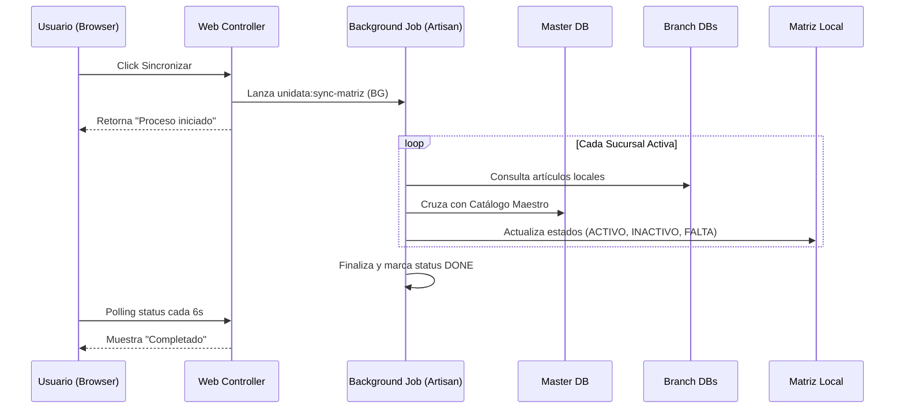

# Documentación Técnica - Proyecto Unidata

## 1. Descripción General
**Unidata** es un portal centralizado de gestión y sincronización de catálogos (especialmente artículos) entre múltiples sucursales distribuidas. El sistema actúa como un "hub" que permite consolidar la información de una Base de Datos Maestra (`db_master`) y replicar/validar el estado de los artículos en diversas bases de datos locales (sucursales).

## 2. Arquitectura del Sistema
El proyecto está construido sobre **Laravel 11** y utiliza una arquitectura de bases de datos distribuidas.

- **Portal Central**: Orquestador principal que gestiona las conexiones y la interfaz de usuario.
- **Base de Datos Maestra (Master)**: Contiene la verdad única sobre los productos.
- **Bases de Datos de Sucursales**: Instancias externas (generalmente MariaDB/MySQL) a las que el sistema se conecta dinámicamente.

### Diagrama de Flujo de Sincronización

## 3. Modelo de Datos (Entidades Clave)

### `Branch` (Sucursales)
Almacena las credenciales de conexión para cada sucursal.
- **Campos**: `code`, `name`, `db_host`, `db_user`, `db_password`, `db_database`, `status`.

### `DbMasterArticle` (Artículos Maestros)
Es el espejo o la fuente de verdad del catálogo.
- **Campos**: `clave`, `descripcion`, `unidad_medida`, `precio_lista`, `costo_venta`, etc.

### `MatrizHomologacion` (Matriz de Estado)
La tabla principal de consulta en el portal. Consolida en una sola fila el estado de un artículo en TODAS las sucursales.
- **Campos**: `clave`, `descripcion`, y columnas dinámicas por sucursal (ej: `en_matriz`, `en_ilu`, `en_washington`).

## 4. Módulos Principales

### 📦 Gestión de Artículos
- **Carga de CSV**: Permite importar miles de registros al catálogo maestro con una vista previa de validación.
- **Historial de Subidas**: Registro de quién subió qué archivo y capacidad de "Revertir" (Rollback) cambios masivos.

### 🔄 Motor de Homologación (Sync)
- **Sincronización en Fondo**: Implementada para Windows/XAMPP usando el comando `start /B`. Esto evita que la web se bloquee mientras se procesan miles de registros.
- **Polling en Tiempo Real**: El frontend consulta un archivo JSON de estado para mostrar barras de progreso y mensajes de log.

### 📂 Centro de Descargas (GDC)
- Sistema para generar reportes Excel pesados en segundo plano. Una vez que el archivo está listo, el usuario recibe una notificación en la campana de descargas para bajarlo sin haber esperado con el navegador bloqueado.

## 5. Stack Tecnológico
- **Backend**: PHP 8.2+ / Laravel 11.
- **Base de Datos**: MySQL / MariaDB (Multi-conexión).
- **Frontend**: Blade, CSS Nativo (Variables), JavaScript (Vanilla + SweetAlert2).
- **Estética**: Diseño moderno estilo Dashboard (Sidebar oscuro, tarjetas limpias, fuentes Inter y Instrument Sans).
